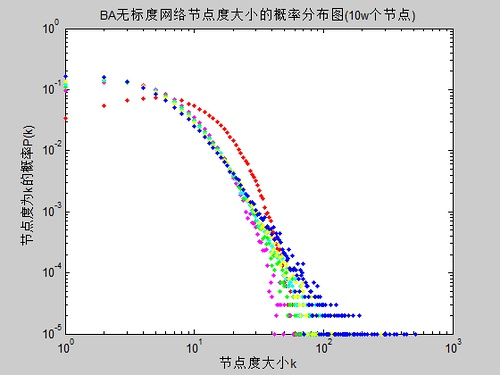
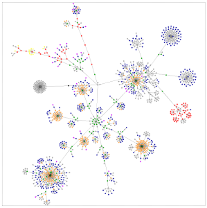
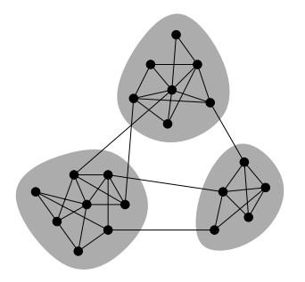
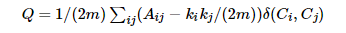
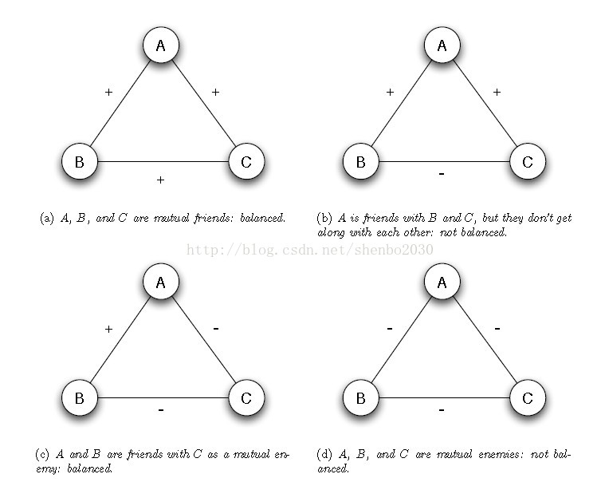

参考：  
《复杂网络分析总结》 https://www.cnblogs.com/maybe2030/p/4665847.html  
《复杂网络中聚类算法总结》 https://www.cnblogs.com/tychyg/p/5277137.html  
《复杂网络介绍（Network Analysis）》 https://www.jianshu.com/p/4f04bb52ae39  

# 定义
- 具有自组织、自相似、吸引子、小世界、无标度中部分或全部性质的网络称之为复杂网络 — 钱学森  
- 言外之意，复杂网络就是指一种呈现高度复杂性的网络  

**其特点主要具体体现在如下几个方面：**   

# 小世界特性
- 小世界特性（Small world theory）/ 六度空间理论 / 六度分割理论（Six degrees of separation）  

小世界特性指出：社交网络中的任何一个成员和任何一个陌生人之间所间隔的人不会超过六个。  

在考虑网络特征的时候，通常使用两个特征来衡量网络：  

**特征路径长度（characteristic path length）：** 在网络中，任选两个节点，连通这两个节点的最少边数，定义为这两个节点的路径长度，网络中所有节点对的路径长度的均值，定义为网络的特征路径长度。这是网络的全局特征。  

**聚合系数(clustering coefficient)：**假设某个节点有k条边，则这k条边连接的节点（k个）之间最多可能存在的边的条数为k(k−1)/2，用实际存在的边数除以最多可能存在的边数得到的分数值，定义为这个节点的聚合系数。所有节点的聚合系数的均值定义为网络的聚合系数。
聚合系数是网络的局部特征，反映了相邻两个人之间朋友圈子的重合度，即该节点的朋友之间也是朋友的程度。  

对于规则网络，任意两个点（个体）之间的特征路径长度长（通过多少个体联系在一起），但聚合系数高（你是朋友的朋友的朋友的几率高）。对于随机网络，任意两个点之间的特征路径长度短，但聚合系数低。而小世界网络，点之间特征路径长度小，接近随机网络，而聚合系数依旧相当高，接近规则网络。  

复杂网络的小世界特性跟网络中的信息传播有着密切的联系。实际的社会、生态、等网络都是小世界网络，在这样的系统里，信息传递速度快，并且少量改变几个连接，就可以剧烈地改变网络的性能，如对已存在的网络进行调整，如蜂窝电话网，改动很少几条线路，就可以显著提高性能。  

# 无标度特性
现实世界的网络大部分都不是随机网络，少数的节点往往拥有大量的连接，而大部分节点却很少，节点的度数分布符合幂率分布，而这就被称为是网络的**无标度特性（Scale-free）**
将度分布符合幂律分布的复杂网络称为无标度网络。  

下图为一个具有10万个节点的BA无标度网络的度数分布示意图：  

  

无标度特性反映了复杂网络具有严重的异质性，其各节点之间的连接状况（度数）具有严重的不均匀分布性：网络中少数称之为Hub点的节点拥有极其多的连接，而大多数节点只有很少量的连接。少数Hub点对无标度网络的运行起着主导的作用。从广义上说，无标度网络的无标度性是描述大量复杂系统整体上严重不均匀分布的一种内在性质。  

其实复杂网络的无标度特性与网络的鲁棒性分析具有密切的关系。无标度网络中幂律分布特性的存在极大地提高了高度数节点存在的可能性，因此，无标度网络同时显现出针对随机故障的鲁棒性和针对蓄意攻击的脆弱性。这种鲁棒且脆弱性对网络容错和抗攻击能力有很大影响。研究表明，无标度网络具有很强的容错性，但是对基于节点度值的选择性攻击而言，其抗攻击能力相当差，高度数节点的存在极大地削弱了网络的鲁棒性，一个恶意攻击者只需选择攻击网络很少的一部分高度数节点，就能使网络迅速瘫痪。  

# 社区结构特性

复杂网络中的节点往往也呈现出集群特性。例如，社会网络中总是存在熟人圈或朋友圈，其中每个成员都认识其他成员。集群程度的意义是网络集团化的程度；这是一种网络的内聚倾向。连通集团概念反映的是一个大网络中各集聚的小网络分布和相互联系的状况。例如，它可以反映这个朋友圈与另一个朋友圈的相互关系。  

下图为网络聚集现象的一种描述：  

  

 

## 社区检测
**社区检测（community detection）** 又被称为是社区发现，它是用来揭示网络聚集行为的一种技术。社区检测实际就是一种网络聚类的方法，这里的“社区”在文献中并没有一种严格的定义，我们可以将其理解为一类具有相同特性的节点的集合。近年来，社区检测得到了快速的发展，这主要是由于复杂网络领域中的大牛Newman提出了一种模块度（modularity）的概念，从而使得网络社区划分的优劣可以有一个明确的评价指标来衡量。一个网络不通情况下的社区划分对应不同的模块度，模块度越大，对应的社区划分也就越合理；如果模块度越小，则对应的网络社区划分也就越模糊。  

下图描述了网络中的社区结构：  

  

Newman提出的模块度计算公式如下:  

  

其中m为网络中总的边数，A是网络对应的邻接矩阵，Aij=1代表节点i和节点j之间存在连边，否则不存在连边。ki为节点i的度数，Ci为节点i属于某个社区的标号，而δ(Ci,Cj)=1当且仅当Ci=Cj。  

上述的模块度定义其实很好理解，我们可以根据一个网络的空模型去进行理解。网络的空模型可以理解为只有节点的而没有连边，这时候一个节点可以和图中的任意其他节点相连，并且节点i和j相连的概率可以通过计算得到。随机选择一个节点与节点i相连的概率为kj/2m，随机选择一个节点与节点j相连的概率为kj/2m，那么节点i和节点j相连的概率为pipj=kikj/(4m2)，边数的期望值Pij=2mpipj=kikj/(2m)。  

**所以模块度其实就是指一个网络在某种社区划分下与随机网络的差异，因为随机网络并不具有社区结构，对应的差异越大说明该社区划分越好。**  

Newman提出的模块度具有两方面的意义：  

1. 模块度的提出成为了社区检测评价一种常用指标，它是度量网络社区划分优劣的量化指标；  
2. 模块度的提出极大地促进了各种优化算法应用于社区检测领域的发展。在模块度的基础之上，许多优化算法以模块度为优化的目标方程进行优化，从而使得目标函数达到最大时得到不错的社区划分结果。  

当然，模块度的概念不是绝对合理的，它也有弊端，比如分辨率限制问题等，后期国内学者在模块度的基础上提出了模块度密度的概念，可以很好的解决模块度的弊端，这里就不详细介绍了。  

常用的社区检测方法主要有如下几种：  
1. 基于图分割的方法，如Kernighan-Lin算法，谱聚类算法等；  
2. 基于层次聚类的方法，如GN算法、Newman快速算法等；  
3. 基于模块度优化的方法，如贪婪算法、模拟退火算法、Memetic算法、PSO算法、进化多目标优化算法等。  

## 结构平衡
结构平衡（Structural Balance）主要是针对社交网络的研究而被提出的，它最早源于社会心理学家Heider提出的一个结构平衡理论。  

### 网络平衡的发展
网络平衡有时也称社会平衡（Social Balance），就网络平衡的发展来说，我们可以将其分为三个发展阶段。  
#### 网络平衡理论的提出
“网络平衡”一词最早是由Heider基于对社会心理学的研究而提出的，Heider在1946年的文章Attitudes and cognitive organization[1]中针对网络平衡的概念提出了最早的平衡理论：  
1. 朋友的朋友是朋友；  
2. 朋友的敌人是敌人；  
3. 敌人的朋友是敌人；  
4. 敌人的敌人是朋友。  

用常见的三元组合来表示上述的Heider理论如下：  
  

上述的平衡理论是有关网络平衡提出的最早的理论，它后来也被称为是强平衡理论。  

1956年，Cartwright和Harary对Heider的平衡理论进行了推广，并将其用在了图理论中（STRUCTURAL BALANCE: A GENERALIZATION OF HEIDER'S THEORY[2]）。Cartwright和Harary指出对于一个符号网络而言，网络平衡的充要条件是网络中的所有三元组都是平衡的，该结论也可以陈述为一个符号网络平衡的充要条件是它所包含的所有回路（cycles）都是平衡的（“-”号的个数为整数个）。而且，在这篇文章中，他们还提出了著名的结构平衡理论：如果一个符号网络是平衡的，那么这个网络就可以分为两部分子网络，其中每个子网络内部中节点的连接都是正连接，网络之间的连接均为负连接。  

在这各阶段网络平衡的发展的重心主要在于构建网络平衡的心理学和社会学模型。  

#### 网络平衡的数学模型
在有了Heider等人的奠基工作后，有关网络平衡的发展主要是构建其数学模型，比如网络的动态表现，一个网络连接如何随时间的变化而变化，网络中节点之间的朋友或者敌人的关系如何演化等等。  

#### 网络平衡的应用
最新关于网络平衡方面的研究大都是研究一些在线网络，比如对某个网站用户属性的分析等等。而且，目前我们身处大数据时代，我们所要研究的网络规模也变为了大型甚至可以说是超大型网络，这这个背景下，如何计算一个网络是否平衡便成为该领域的主要热点问题。  

### 网络平衡的基本理论
1. Heider理论（强平衡理论SBT）。
2. 结构平衡理论（Structural Balance Theroem）：在完全符号网络中，网络平衡的充要条件是其所有的三元组（回路）都平衡。  
结构平衡的推论：一个完全符号网络平衡的充要条件是它可以被分为两部分X和Y，X和Y内部的节点连接均为正连接，X和Y之间的连接均为负连接。
3. 弱平衡理论（A weaker form of structural balance，WSBT）：如果完全符号网络中不存在这样的三元组：两个边为正，一边为负，则该网络称为是弱平衡网络。  
对于弱平衡理论而言，上图的三元组中，三边均为负连接的三元组也属于平衡三元组，也就是三元组的四种情况有三种属于平衡状态，一个属于不平衡状态（两边为正，一边为负）。  
- 弱平衡网络推论：如果一个网络为弱平衡理论，那么它可以分为多个部分，每部分内的连接为正，部分之间的连接为负。
4. 对任意网络平衡的定义：
* 对于一个任意网络而言，如果我们可以将它所缺失的边填充使它成为一个平衡的完全符号网络，那么原网络就是平衡网络；
* 对于一个任意网络而言，如果我们可以将它分为两部分，使得每个部分内的连接均为实线，部分之间的连接均为虚线。
　　以上的两种定义是等价的。
　　一个符号网络平衡的充要条件是它不包括含有奇数个负连接的回路。
5. 近似平衡网络（略）。

### 网络平衡的计算（A spectral algorithm for computing social balance）

## 影响最大化
随着各种在线社交平台的发展，社交平台（比如QQ、微博、朋友圈等）已经不仅仅是一种用户进行沟通的社交平台，它们更是社会信息产生和传播的一种主要的媒介。影响最大化（Influence Maximization）同结构平衡一样，也是针对社会网络的研究而被提出的，它来源于经济学的市场营销。2001年，影响最大化被Domins首次以一种算法问题的形式被提出。而影响最大化受到广泛的关注是在2003年Kempe等人在当年的KDD会议上发表的一篇有关影响最大化的论文之后，随后各种影响最大化算法被迅速提出，最近的十几年里，影响最大化的相关文章达到了上千篇，可见这个问题还是很值得关注的。  

影响最大化问题可以这样来描述：一个商家或者企业利用一种社交平台（比如为新浪微博）为自己的新产品或者新服务进行推广，如何在资金有限的情况下雇佣微博达人来做推广可以使得推广范围达到最大？  

我们再给出影响最大化的一般定义：  

给定一个网络G和一个整数K（一般小于50），如何在G中找出K个节点，使得这K的节点组成的节点集合S的影响传播范围σ(S)达到最大。  

根据上述影响最大化的定义我们很容易可以知道，影响最大化本身属于一种组合优化问题。常用的影响最大化传播模型有独立级联传播模型（ICM）和线性阈值传播模型（LTM）。  

影响最大化方面的主要算法可以分为如下几类：  
1. 基于网络中心性的启发式方法：比如最大度方法、最短平均距离方法、PageRank方法等；
2. 基于子模块性的贪婪方法：比如最经典的Greedy算法，CELF算法以及后来的NewGreedy和CELF++等；
3. 基于社区结构的方法：比如CGA算法、CIM算法等；
4. 基于目标函数优化的方法：比如模拟退火算法等。

## 网络传播
网络传播领域涉及很多方面，比如网络节点重要性排序、网络鲁棒性分析、网络信息爆发阈值优化等。 

# 复杂网络模型的构造
真实网络所表现出来的小世界特性、无尺度幂律分布或高聚集度等现象促使人们从理论上构造出多样的网络模型，以解释这些统计特性，探索形成这些网络的演化机制。本节介绍了几个经典网络模型的原理和构造方法，包括ER随机网络模型、BA无尺度网络模型和小世界模型。  

## ER随机网络模型
ErdOs-Renyi随机网络模型(简称ER随机网络模型)是匈牙利数学家Erdos和Renyi提出的一种网络模型。1959年，为了描述通信和生命科学中的网络，Erdos和Renyi提出，通过在网络节点间随机地布置连接，就可以有效地模拟出这类系统。这种方法及相关定理的简明扼要，导致了图论研究的复兴，数学界也因此出现了研究随机网络的新领域。ER随机网络模型在计算机科学、统计物理、生命科学、通信工程等领域都得到了广泛应用。  

ER随机网络模型是个机会均等的网络模型。在该网络模型中，给定一定数目的个体(节点)，它和其他任意一个个体(节点)之间有相互关系(连接)的概率相同，记为户。因为一个节点连接k个其他节点的概率，会随着k值的增大而呈指数递减。这样，如果定义是为每个个体所连接的其他个体的数目，可以知道连接概率p(k)服从钟形的泊松(Poisson)分布，有时随机网络也称作指数网络。  

随机网络理论有一项重要预测：尽管连接是随机安置的，但由此形成的网络却是高度民主的，也就是说，绝大部分节点的连接数目会大致相同。实际上，随机网络中连接数目比平均数高许多或低许多的节点，都十分罕见。  

在过去40多年里，科学家习惯于将所有复杂网络都看作是随机网络。在1998年研究描绘万维网(以网页为节点、以超级链接为边)的项目时，学者们原以为会发现一个随机网络：人们会根据自己的兴趣，来决定将网络文件链接到哪些网站，而个人兴趣是多种多样的，可选择的网页数量也极其庞大，因而最终的链接模式将呈现出相当随机的结果。  

然而，事实并非如此。因为在万维网上，并非所有的节点都是平等的。在选择将网页链接到何处时，人们可以从数十亿个网站中进行选择。然而，我们中的大部分人只熟悉整个万维网的一小部分，这一小部分中往往包含那些拥有较多链接的站点，因为这样的站点更容易为人所知。只要链接到这些站点，就等于造就或加强了对它们的偏好。这种“择优连接(Preferential Attachment)”的过程，也发生在其他网络中。在Internet上，那些具有较多连接的路由器通常也拥有更大的带宽，因而新用户就更倾向于连接到这些路由器上。在美国的生物技术产业内，某些知名公司更容易吸引到同盟者，而这又进一步加强了它在未来合作中的吸引力。类似地，在论文引用网络(论文为节点，引用关系为边)中，被引用次数较多的科学文献，会吸引更多的研究者去阅读并引用它。针对这些网络的“择优连接”的新特性，学者提出了BA无尺度网络模型。  

## BA无尺度网络模型
无尺度网络的发现，使人类对于复杂网络的认识进入了一个新的天地。无尺度网络的最主要特征是节点的度分布服从幂次定律。BA模型是无尺度网络(Scale-free Network)的第一个抽象模型。由于考虑了系统的成长性(Growth)和择优连接性，BA模型给我们带来了很多启发，并且可以应用于多种实际网络。但是BA模型的两个基本假定，对于解释许多现实中的现象来说过于简单，与现实的网络还有较大的距离。  

有学者试图对BA模型进行扩展，即根据现实中的网络，增添某些假定，以便进一步探索复杂网络系统的规律。对BA模型的扩充可以考虑三个因素：择优选择的成本、边的重新连接、网络的初始状态。扩充的BA模型可以更好地模拟现实世界中的网络现象。  

### 无尺度网络
1999年，丸Barabasi和兄Albert在对互联网的研究中发现了无尺度网络，使人类对于复杂网络系统有了全新的认识。过去，人们习惯于将所有复杂网络看作是随机网络，但Barabasi和Albert发现互联网实际上是由少数高连接性的页面组织起来的，80％以上页面的链接数不到4个。只占节点总数不到万分之一的极少数节点，却有1000个以上的链接。这种网页的链接分布遵循所谓的“幂次定律”：任何一个节点拥有是条连接的概率，与1／k成正比。它不像钟形曲线那样具有一个集中度很高的峰值，而是一条连续递减的曲线。如果取双对数坐标系来描述幂次定律，得到的是一条直线。  

Scale-free网络指的是节点的度分布符合幂律分布的网络，由于其缺乏一个描述问题的特征尺度而被称为无尺度网络。其后的几年中，研究者们在许多不同的领域中都发现了无尺度网络。从生态系统到人际关系，从食物链到代谢系统，处处可以看到无尺度网络。  

### BA模型及其机制
为什么随机模型与实际不相符合呢?Barabasi和Albert在深入分析了ER模型之后，发现问题在于ER模型讨论的网络是一个既定规模的，不会继续扩展的网络。正是由于现实当中的网络往往具有不断成长的特性，早进入的节点(老节点)获得连接的概率就更大。当网络扩张到一定规模以后，这些老节点很容易成为拥有大量连接的集散节点。这就是网络的“成长性”。  

其次，ER模型中每个节点与其他节点连接时，建立连接的概率是相同的。也就是说，网络当中所有的节点都是平等的。这一情况与实际也不相符。例如，新成立的网站选择与其他网站链接时，自然是在人们所熟知的网站中选择一个进行链接，新的个人主页上的超文本链接更有可能指向新浪、雅虎等著名的站点。由此，那些熟知的网站将获得更多的链接，这种特性称为“择优连接”。这种现象也称为“马太效应(Matthew Effect)”或“富者更富(Rich Get Richer)”。  

“成长性”和“择优连接”这两种机制解释了网络当中集散节点的存在。   

### BA模型的改进方向
BA无尺度模型的关键在于，它把实际复杂网络的无尺度特性归结为增长和优先连接这两个非常简单的机制。当然，这也不可避免地使得BA无尺度网络模型和真实网络相比存在一些明显的限制。比如，一些实际网络的局域特性对网络演化结果的影响、外界对网络节点及其连接边删除的影响等。  

一般自然的或者人造的现实网络与外界之间有节点交换，节点间连接也在不断变化，网络自身具有一定的自组织能力，会对自身或者外界的变化作出相应的反应。因此，在BA模型基础上，可以把模型的动力学过程进行推广，包括对网络中已有节点或者连接的随机删除及其相应的连接补偿机制。
对每一个时间步长，考虑如下三种假设：  

* 成长假设：一个带有m个择优连接的新节点加入网络，这个新节点选择网络中m个节点，即对于每一个连接，一个度为是的节点作为目标被选择的概率正比于k；  
* 删除假设：考虑网络中若干个节点，这些节点与其他节点之间的连接边被随机地选作目标边而被删除，导致网络的演化；  
* 补偿假设：网络中失去一个连接，同时产生n个连接进行补偿，其中”有上确界，是一个受网络补偿能力限制的量，这里的补偿连接所选择的目标节点也遵循择优连接原则。  

利用以上三种假设，很多学者已经对BA模型进行了有效的改进，读者可参考相关文献，此处不再详述。  
## 小世界网络模型
复杂网络研究中一个重要的发现是绝大多数大规模真实网络的平均路径长度比想象的小得多，称之为“小世界现象”，或称“六度分离(Six Degrees of Separation)”。  

所谓小世界现象，是来自社会网络(Social Networks)中的基本现象，即每个人只需要很少的中间人(平均6个)就可以和全世界的人建立起联系。在这一理论中，每个人可看作是网络的一个节点，并有大量路径连接着他们，相连接的节点表示互相认识的人。  

1998年，Watts和Strogatz引入了一个介于规则网络和完全随机网络之间的单参数小世界网络模型，称为WS小世界模型，该模型较好地体现了社会网络的小平均路径长度和大聚类系数两种现象。
WS小世界模型的构造方法如下：  

1. 从规则图开始，考虑一个含有N个节点的规则网络，它们圈成一个环，其中每个节点都与它左右相邻的各K／2个节点相连接，K为偶数；  
2. 随机化重连，以概率户随机地重新连接网络中的每条边(将边的一个端点保持不变，而另一个端点取为网络中随机选择的一个节点)，其中规定，任意两个不同的节点之间至多只能有一条边，并且每一个节点都不能有边与其自身相连。  

在WS小世界模型中，p＝0对应于规则网络，p＝l则对应于完全随机网络，通过调节声的值就可以控制从规则网络到完全随机图的过渡。因此，WS小世界网络是介于规则网络和随机网络之间的一种网络。  

WS小世界模型构造算法中的随机化过程有可能破坏网络的连通性。因此，Newman和Watts稍后提出了NW小世界模型。NW小世界模型的构造方法如下：  

1. 从规则图开始，考虑一个含有N个点的规则网络，它们圈成一个环，其中每个节点都与它左右的相邻的各K／2节点相连，K是偶数；  
2. 随机化加边，以概率p随机选取的一对节点之间加上一条边。其中规定，任意两个不同的节点之间至多只能有一条边，并且每一个节点都不能有边与自身相连。  

NW模型只是将WS小世界模型构造中的“随机化重连”改为“随机化加边”。  

NW模型不同于WS模型之处在于它不切断规则网络中的原始边，而是以概率p重新连接一对节点。这样构造出来的网络同时具有大的聚类数和小的平均距离。NW模型的优点在于其简化了理论分析，因为WS模型可能存在孤立节点，但NW模型不会。当户足够小和N足够大时，NW小世界模型本质上就等同于WS小世界模型。  

小世界网络模型反映了实际网络所具有的一些特性，例如朋友关系网，大部分人的朋友都是和他们住在同一个地方，其地理位置不是很远，或只在同一单位工作或学习的同事和同学。另一方面，也有些人住得较远的，甚至是远在异国他乡的朋友，这种情形好比WS小世界模型中通过重新连线或在NW小世界模型中通过加入连线产生的远程连接。  

小世界网络模型的主要特征之一是节点之间的平均距离随远程连接的个数而指数下降。对于规则网络，平均距离L可估计为L正比于N；而对于小世界网络模型，L正比于ln(N)／1n(K)。例如，对于一个千万人口的城市，人与人的平均接触距离是6左右，这使得生活人群之间的距离大大缩短。该模型由一个规则的环组成，通常是一个一维的几乎具有周期性边界条件的环(即环中每个节点几乎都连接到一固定数目的邻近节点)和少量的随机选取节点连接成的“捷径” (重新连接现存的边)。小世界网络同时具有“高网络聚集度”和“低平均路径”的特性。  

从小世界网络模型中可以看到，只要改变很少的几个连接，就可以剧烈的改变网络的性能。这样的性质也可以应用其他网络，尤其是对已有网络的调整方面。例如，蜂窝电话网，改动很少几条线路(低成本、低工作量)的连接，就可以显著提高性能。也可以应用到互联网的主干路由器上，以改变流量和提高传输速度。同样的思路也可以应用到电子邮件的快速传递、特定Web站点的定位等。  
