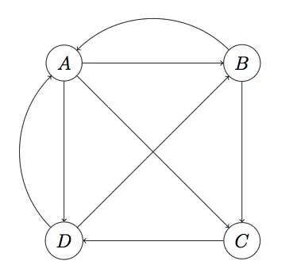

参考：  
《复杂网络分析总结》 https://www.cnblogs.com/maybe2030/p/4665847.html  
《复杂网络中聚类算法总结》 https://www.cnblogs.com/tychyg/p/5277137.html  
《复杂网络介绍（Network Analysis）》 https://www.jianshu.com/p/4f04bb52ae39  
《复杂网络分析-个人笔记 总结》 https://www.cnblogs.com/baiyunwanglai/p/13228813.html  

**本文包括以下内容：**
* 复杂网络的特性
	- 小世界特性
	- 无标度特性
	- 社区结构特性
* 复杂网络模型的构造
	- ER随机网络模型
	- BA无尺度网络模型
	- 小世界网络模型
* 网络基本概念
	- 节点数、连接数、密度、聚集系数、传递性、互惠性等
* 中心性分析
	- 点度中心性
	- 中介中心性
	- 接近中心性
	- 特征向量中心性
	- PageRank

# 复杂网络的特性

# 定义
- 具有自组织、自相似、吸引子、小世界、无标度中部分或全部性质的网络称之为复杂网络 — 钱学森  
- 言外之意，复杂网络就是指一种呈现高度复杂性的网络  

**其特点主要具体体现在如下几个方面：**   

# 小世界特性
- 小世界特性（Small world theory）/ 六度空间理论 / 六度分割理论（Six degrees of separation）  

小世界特性指出：社交网络中的任何一个成员和任何一个陌生人之间所间隔的人不会超过六个。  

在考虑网络特征的时候，通常使用两个特征来衡量网络：  

**特征路径长度（characteristic path length）：** 在网络中，任选两个节点，连通这两个节点的最少边数，定义为这两个节点的路径长度，网络中所有节点对的路径长度的均值，定义为网络的特征路径长度。这是网络的全局特征。  

**聚合系数(clustering coefficient)：**假设某个节点有k条边，则这k条边连接的节点（k个）之间最多可能存在的边的条数为k(k−1)/2，用实际存在的边数除以最多可能存在的边数得到的分数值，定义为这个节点的聚合系数。所有节点的聚合系数的均值定义为网络的聚合系数。
聚合系数是网络的局部特征，反映了相邻两个人之间朋友圈子的重合度，即该节点的朋友之间也是朋友的程度。  

对于规则网络，任意两个点（个体）之间的特征路径长度长（通过多少个体联系在一起），但聚合系数高（你是朋友的朋友的朋友的几率高）。对于随机网络，任意两个点之间的特征路径长度短，但聚合系数低。而小世界网络，点之间特征路径长度小，接近随机网络，而聚合系数依旧相当高，接近规则网络。  

复杂网络的小世界特性跟网络中的信息传播有着密切的联系。实际的社会、生态、等网络都是小世界网络，在这样的系统里，信息传递速度快，并且少量改变几个连接，就可以剧烈地改变网络的性能，如对已存在的网络进行调整，如蜂窝电话网，改动很少几条线路，就可以显著提高性能。  

# 无标度特性
现实世界的网络大部分都不是随机网络，少数的节点往往拥有大量的连接，而大部分节点却很少，节点的度数分布符合幂率分布，而这就被称为是网络的**无标度特性（Scale-free）**
将度分布符合幂律分布的复杂网络称为无标度网络。  

下图为一个具有10万个节点的BA无标度网络的度数分布示意图：  

  

无标度特性反映了复杂网络具有严重的异质性，其各节点之间的连接状况（度数）具有严重的不均匀分布性：网络中少数称之为Hub点的节点拥有极其多的连接，而大多数节点只有很少量的连接。少数Hub点对无标度网络的运行起着主导的作用。从广义上说，无标度网络的无标度性是描述大量复杂系统整体上严重不均匀分布的一种内在性质。  

其实复杂网络的无标度特性与网络的鲁棒性分析具有密切的关系。无标度网络中幂律分布特性的存在极大地提高了高度数节点存在的可能性，因此，无标度网络同时显现出针对随机故障的鲁棒性和针对蓄意攻击的脆弱性。这种鲁棒且脆弱性对网络容错和抗攻击能力有很大影响。研究表明，无标度网络具有很强的容错性，但是对基于节点度值的选择性攻击而言，其抗攻击能力相当差，高度数节点的存在极大地削弱了网络的鲁棒性，一个恶意攻击者只需选择攻击网络很少的一部分高度数节点，就能使网络迅速瘫痪。  

# 社区结构特性

复杂网络中的节点往往也呈现出集群特性。例如，社会网络中总是存在熟人圈或朋友圈，其中每个成员都认识其他成员。集群程度的意义是网络集团化的程度；这是一种网络的内聚倾向。连通集团概念反映的是一个大网络中各集聚的小网络分布和相互联系的状况。例如，它可以反映这个朋友圈与另一个朋友圈的相互关系。  

下图为网络聚集现象的一种描述：  

  

 

## 社区检测
**社区检测（community detection）** 又被称为是社区发现，它是用来揭示网络聚集行为的一种技术。社区检测实际就是一种网络聚类的方法，这里的“社区”在文献中并没有一种严格的定义，我们可以将其理解为一类具有相同特性的节点的集合。近年来，社区检测得到了快速的发展，这主要是由于复杂网络领域中的大牛Newman提出了一种模块度（modularity）的概念，从而使得网络社区划分的优劣可以有一个明确的评价指标来衡量。一个网络不通情况下的社区划分对应不同的模块度，模块度越大，对应的社区划分也就越合理；如果模块度越小，则对应的网络社区划分也就越模糊。  

下图描述了网络中的社区结构：  

  

Newman提出的模块度计算公式如下:  

  

其中m为网络中总的边数，A是网络对应的邻接矩阵，Aij=1代表节点i和节点j之间存在连边，否则不存在连边。ki为节点i的度数，Ci为节点i属于某个社区的标号，而δ(Ci,Cj)=1当且仅当Ci=Cj。  

上述的模块度定义其实很好理解，我们可以根据一个网络的空模型去进行理解。网络的空模型可以理解为只有节点的而没有连边，这时候一个节点可以和图中的任意其他节点相连，并且节点i和j相连的概率可以通过计算得到。随机选择一个节点与节点i相连的概率为kj/2m，随机选择一个节点与节点j相连的概率为kj/2m，那么节点i和节点j相连的概率为pipj=kikj/(4m2)，边数的期望值Pij=2mpipj=kikj/(2m)。  

**所以模块度其实就是指一个网络在某种社区划分下与随机网络的差异，因为随机网络并不具有社区结构，对应的差异越大说明该社区划分越好。**  

Newman提出的模块度具有两方面的意义：  

1. 模块度的提出成为了社区检测评价一种常用指标，它是度量网络社区划分优劣的量化指标；  
2. 模块度的提出极大地促进了各种优化算法应用于社区检测领域的发展。在模块度的基础之上，许多优化算法以模块度为优化的目标方程进行优化，从而使得目标函数达到最大时得到不错的社区划分结果。  

当然，模块度的概念不是绝对合理的，它也有弊端，比如分辨率限制问题等，后期国内学者在模块度的基础上提出了模块度密度的概念，可以很好的解决模块度的弊端，这里就不详细介绍了。  

常用的社区检测方法主要有如下几种：  
1. 基于图分割的方法，如Kernighan-Lin算法，谱聚类算法等；  
2. 基于层次聚类的方法，如GN算法、Newman快速算法等；  
3. 基于模块度优化的方法，如贪婪算法、模拟退火算法、Memetic算法、PSO算法、进化多目标优化算法等。  

## 结构平衡
结构平衡（Structural Balance）主要是针对社交网络的研究而被提出的，它最早源于社会心理学家Heider提出的一个结构平衡理论。  

### 网络平衡的发展
网络平衡有时也称社会平衡（Social Balance），就网络平衡的发展来说，我们可以将其分为三个发展阶段。  
#### 网络平衡理论的提出
“网络平衡”一词最早是由Heider基于对社会心理学的研究而提出的，Heider在1946年的文章Attitudes and cognitive organization[1]中针对网络平衡的概念提出了最早的平衡理论：  
1. 朋友的朋友是朋友；  
2. 朋友的敌人是敌人；  
3. 敌人的朋友是敌人；  
4. 敌人的敌人是朋友。  

用常见的三元组合来表示上述的Heider理论如下：  
  

上述的平衡理论是有关网络平衡提出的最早的理论，它后来也被称为是强平衡理论。  

1956年，Cartwright和Harary对Heider的平衡理论进行了推广，并将其用在了图理论中（STRUCTURAL BALANCE: A GENERALIZATION OF HEIDER'S THEORY[2]）。Cartwright和Harary指出对于一个符号网络而言，网络平衡的充要条件是网络中的所有三元组都是平衡的，该结论也可以陈述为一个符号网络平衡的充要条件是它所包含的所有回路（cycles）都是平衡的（“-”号的个数为整数个）。而且，在这篇文章中，他们还提出了著名的结构平衡理论：如果一个符号网络是平衡的，那么这个网络就可以分为两部分子网络，其中每个子网络内部中节点的连接都是正连接，网络之间的连接均为负连接。  

在这各阶段网络平衡的发展的重心主要在于构建网络平衡的心理学和社会学模型。  

#### 网络平衡的数学模型
在有了Heider等人的奠基工作后，有关网络平衡的发展主要是构建其数学模型，比如网络的动态表现，一个网络连接如何随时间的变化而变化，网络中节点之间的朋友或者敌人的关系如何演化等等。  

#### 网络平衡的应用
最新关于网络平衡方面的研究大都是研究一些在线网络，比如对某个网站用户属性的分析等等。而且，目前我们身处大数据时代，我们所要研究的网络规模也变为了大型甚至可以说是超大型网络，这这个背景下，如何计算一个网络是否平衡便成为该领域的主要热点问题。  

### 网络平衡的基本理论
1. Heider理论（强平衡理论SBT）。
2. 结构平衡理论（Structural Balance Theroem）：在完全符号网络中，网络平衡的充要条件是其所有的三元组（回路）都平衡。  
结构平衡的推论：一个完全符号网络平衡的充要条件是它可以被分为两部分X和Y，X和Y内部的节点连接均为正连接，X和Y之间的连接均为负连接。
3. 弱平衡理论（A weaker form of structural balance，WSBT）：如果完全符号网络中不存在这样的三元组：两个边为正，一边为负，则该网络称为是弱平衡网络。  
对于弱平衡理论而言，上图的三元组中，三边均为负连接的三元组也属于平衡三元组，也就是三元组的四种情况有三种属于平衡状态，一个属于不平衡状态（两边为正，一边为负）。  
- 弱平衡网络推论：如果一个网络为弱平衡理论，那么它可以分为多个部分，每部分内的连接为正，部分之间的连接为负。
4. 对任意网络平衡的定义：
* 对于一个任意网络而言，如果我们可以将它所缺失的边填充使它成为一个平衡的完全符号网络，那么原网络就是平衡网络；
* 对于一个任意网络而言，如果我们可以将它分为两部分，使得每个部分内的连接均为实线，部分之间的连接均为虚线。
　　以上的两种定义是等价的。
　　一个符号网络平衡的充要条件是它不包括含有奇数个负连接的回路。
5. 近似平衡网络（略）。

### 网络平衡的计算（A spectral algorithm for computing social balance）
* 命题1：节点i参与的三元组数目   
A为邻接矩阵，元素取值可能为：1,-1,0  
G为邻接矩阵，元素取值可能为：0,1.

* 命题2：对于节点i而言，bi为其参与的平衡三元组数目，ui为其参与的不平衡三元组数目，则   
    - 理论1：对于完全符号图而言，
        
      平衡三元组所占的比例为
        
    - 理论2：对于任意符号网络，平衡三元组所占的比例为
        
        

注：以上两个计算网络平衡的公式中，特征值可以随大到小选择前几个比较大的，就像PCA那样，这样可以使得计算的复杂度大大减小。  

## 影响最大化
随着各种在线社交平台的发展，社交平台（比如QQ、微博、朋友圈等）已经不仅仅是一种用户进行沟通的社交平台，它们更是社会信息产生和传播的一种主要的媒介。影响最大化（Influence Maximization）同结构平衡一样，也是针对社会网络的研究而被提出的，它来源于经济学的市场营销。2001年，影响最大化被Domins首次以一种算法问题的形式被提出。而影响最大化受到广泛的关注是在2003年Kempe等人在当年的KDD会议上发表的一篇有关影响最大化的论文之后，随后各种影响最大化算法被迅速提出，最近的十几年里，影响最大化的相关文章达到了上千篇，可见这个问题还是很值得关注的。  

影响最大化问题可以这样来描述：一个商家或者企业利用一种社交平台（比如为新浪微博）为自己的新产品或者新服务进行推广，如何在资金有限的情况下雇佣微博达人来做推广可以使得推广范围达到最大？  

我们再给出影响最大化的一般定义：  

给定一个网络G和一个整数K（一般小于50），如何在G中找出K个节点，使得这K的节点组成的节点集合S的影响传播范围σ(S)达到最大。  

根据上述影响最大化的定义我们很容易可以知道，影响最大化本身属于一种组合优化问题。常用的影响最大化传播模型有独立级联传播模型（ICM）和线性阈值传播模型（LTM）。  

影响最大化方面的主要算法可以分为如下几类：  
1. 基于网络中心性的启发式方法：比如最大度方法、最短平均距离方法、PageRank方法等；
2. 基于子模块性的贪婪方法：比如最经典的Greedy算法，CELF算法以及后来的NewGreedy和CELF++等；
3. 基于社区结构的方法：比如CGA算法、CIM算法等；
4. 基于目标函数优化的方法：比如模拟退火算法等。

## 网络传播
网络传播领域涉及很多方面，比如网络节点重要性排序、网络鲁棒性分析、网络信息爆发阈值优化等。 

# 复杂网络模型的构造
真实网络所表现出来的小世界特性、无尺度幂律分布或高聚集度等现象促使人们从理论上构造出多样的网络模型，以解释这些统计特性，探索形成这些网络的演化机制。本节介绍了几个经典网络模型的原理和构造方法，包括ER随机网络模型、BA无尺度网络模型和小世界模型。  

## ER随机网络模型
ErdOs-Renyi随机网络模型(简称ER随机网络模型)是匈牙利数学家Erdos和Renyi提出的一种网络模型。1959年，为了描述通信和生命科学中的网络，Erdos和Renyi提出，通过在网络节点间随机地布置连接，就可以有效地模拟出这类系统。这种方法及相关定理的简明扼要，导致了图论研究的复兴，数学界也因此出现了研究随机网络的新领域。ER随机网络模型在计算机科学、统计物理、生命科学、通信工程等领域都得到了广泛应用。  

ER随机网络模型是个机会均等的网络模型。在该网络模型中，给定一定数目的个体(节点)，它和其他任意一个个体(节点)之间有相互关系(连接)的概率相同，记为户。因为一个节点连接k个其他节点的概率，会随着k值的增大而呈指数递减。这样，如果定义是为每个个体所连接的其他个体的数目，可以知道连接概率p(k)服从钟形的泊松(Poisson)分布，有时随机网络也称作指数网络。  

随机网络理论有一项重要预测：尽管连接是随机安置的，但由此形成的网络却是高度民主的，也就是说，绝大部分节点的连接数目会大致相同。实际上，随机网络中连接数目比平均数高许多或低许多的节点，都十分罕见。  

在过去40多年里，科学家习惯于将所有复杂网络都看作是随机网络。在1998年研究描绘万维网(以网页为节点、以超级链接为边)的项目时，学者们原以为会发现一个随机网络：人们会根据自己的兴趣，来决定将网络文件链接到哪些网站，而个人兴趣是多种多样的，可选择的网页数量也极其庞大，因而最终的链接模式将呈现出相当随机的结果。  

然而，事实并非如此。因为在万维网上，并非所有的节点都是平等的。在选择将网页链接到何处时，人们可以从数十亿个网站中进行选择。然而，我们中的大部分人只熟悉整个万维网的一小部分，这一小部分中往往包含那些拥有较多链接的站点，因为这样的站点更容易为人所知。只要链接到这些站点，就等于造就或加强了对它们的偏好。这种“择优连接(Preferential Attachment)”的过程，也发生在其他网络中。在Internet上，那些具有较多连接的路由器通常也拥有更大的带宽，因而新用户就更倾向于连接到这些路由器上。在美国的生物技术产业内，某些知名公司更容易吸引到同盟者，而这又进一步加强了它在未来合作中的吸引力。类似地，在论文引用网络(论文为节点，引用关系为边)中，被引用次数较多的科学文献，会吸引更多的研究者去阅读并引用它。针对这些网络的“择优连接”的新特性，学者提出了BA无尺度网络模型。  

## BA无尺度网络模型
无尺度网络的发现，使人类对于复杂网络的认识进入了一个新的天地。无尺度网络的最主要特征是节点的度分布服从幂次定律。BA模型是无尺度网络(Scale-free Network)的第一个抽象模型。由于考虑了系统的成长性(Growth)和择优连接性，BA模型给我们带来了很多启发，并且可以应用于多种实际网络。但是BA模型的两个基本假定，对于解释许多现实中的现象来说过于简单，与现实的网络还有较大的距离。  

有学者试图对BA模型进行扩展，即根据现实中的网络，增添某些假定，以便进一步探索复杂网络系统的规律。对BA模型的扩充可以考虑三个因素：择优选择的成本、边的重新连接、网络的初始状态。扩充的BA模型可以更好地模拟现实世界中的网络现象。  

### 无尺度网络
1999年，丸Barabasi和兄Albert在对互联网的研究中发现了无尺度网络，使人类对于复杂网络系统有了全新的认识。过去，人们习惯于将所有复杂网络看作是随机网络，但Barabasi和Albert发现互联网实际上是由少数高连接性的页面组织起来的，80％以上页面的链接数不到4个。只占节点总数不到万分之一的极少数节点，却有1000个以上的链接。这种网页的链接分布遵循所谓的“幂次定律”：任何一个节点拥有是条连接的概率，与1／k成正比。它不像钟形曲线那样具有一个集中度很高的峰值，而是一条连续递减的曲线。如果取双对数坐标系来描述幂次定律，得到的是一条直线。  

Scale-free网络指的是节点的度分布符合幂律分布的网络，由于其缺乏一个描述问题的特征尺度而被称为无尺度网络。其后的几年中，研究者们在许多不同的领域中都发现了无尺度网络。从生态系统到人际关系，从食物链到代谢系统，处处可以看到无尺度网络。  

### BA模型及其机制
为什么随机模型与实际不相符合呢?Barabasi和Albert在深入分析了ER模型之后，发现问题在于ER模型讨论的网络是一个既定规模的，不会继续扩展的网络。正是由于现实当中的网络往往具有不断成长的特性，早进入的节点(老节点)获得连接的概率就更大。当网络扩张到一定规模以后，这些老节点很容易成为拥有大量连接的集散节点。这就是网络的“成长性”。  

其次，ER模型中每个节点与其他节点连接时，建立连接的概率是相同的。也就是说，网络当中所有的节点都是平等的。这一情况与实际也不相符。例如，新成立的网站选择与其他网站链接时，自然是在人们所熟知的网站中选择一个进行链接，新的个人主页上的超文本链接更有可能指向新浪、雅虎等著名的站点。由此，那些熟知的网站将获得更多的链接，这种特性称为“择优连接”。这种现象也称为“马太效应(Matthew Effect)”或“富者更富(Rich Get Richer)”。  

“成长性”和“择优连接”这两种机制解释了网络当中集散节点的存在。   

### BA模型的改进方向
BA无尺度模型的关键在于，它把实际复杂网络的无尺度特性归结为增长和优先连接这两个非常简单的机制。当然，这也不可避免地使得BA无尺度网络模型和真实网络相比存在一些明显的限制。比如，一些实际网络的局域特性对网络演化结果的影响、外界对网络节点及其连接边删除的影响等。  

一般自然的或者人造的现实网络与外界之间有节点交换，节点间连接也在不断变化，网络自身具有一定的自组织能力，会对自身或者外界的变化作出相应的反应。因此，在BA模型基础上，可以把模型的动力学过程进行推广，包括对网络中已有节点或者连接的随机删除及其相应的连接补偿机制。
对每一个时间步长，考虑如下三种假设：  

* 成长假设：一个带有m个择优连接的新节点加入网络，这个新节点选择网络中m个节点，即对于每一个连接，一个度为是的节点作为目标被选择的概率正比于k；  
* 删除假设：考虑网络中若干个节点，这些节点与其他节点之间的连接边被随机地选作目标边而被删除，导致网络的演化；  
* 补偿假设：网络中失去一个连接，同时产生n个连接进行补偿，其中”有上确界，是一个受网络补偿能力限制的量，这里的补偿连接所选择的目标节点也遵循择优连接原则。  

利用以上三种假设，很多学者已经对BA模型进行了有效的改进，读者可参考相关文献，此处不再详述。  
## 小世界网络模型
复杂网络研究中一个重要的发现是绝大多数大规模真实网络的平均路径长度比想象的小得多，称之为“小世界现象”，或称“六度分离(Six Degrees of Separation)”。  

所谓小世界现象，是来自社会网络(Social Networks)中的基本现象，即每个人只需要很少的中间人(平均6个)就可以和全世界的人建立起联系。在这一理论中，每个人可看作是网络的一个节点，并有大量路径连接着他们，相连接的节点表示互相认识的人。  

1998年，Watts和Strogatz引入了一个介于规则网络和完全随机网络之间的单参数小世界网络模型，称为WS小世界模型，该模型较好地体现了社会网络的小平均路径长度和大聚类系数两种现象。
WS小世界模型的构造方法如下：  

1. 从规则图开始，考虑一个含有N个节点的规则网络，它们圈成一个环，其中每个节点都与它左右相邻的各K／2个节点相连接，K为偶数；  
2. 随机化重连，以概率户随机地重新连接网络中的每条边(将边的一个端点保持不变，而另一个端点取为网络中随机选择的一个节点)，其中规定，任意两个不同的节点之间至多只能有一条边，并且每一个节点都不能有边与其自身相连。  

在WS小世界模型中，p＝0对应于规则网络，p＝l则对应于完全随机网络，通过调节声的值就可以控制从规则网络到完全随机图的过渡。因此，WS小世界网络是介于规则网络和随机网络之间的一种网络。  

WS小世界模型构造算法中的随机化过程有可能破坏网络的连通性。因此，Newman和Watts稍后提出了NW小世界模型。NW小世界模型的构造方法如下：  

1. 从规则图开始，考虑一个含有N个点的规则网络，它们圈成一个环，其中每个节点都与它左右的相邻的各K／2节点相连，K是偶数；  
2. 随机化加边，以概率p随机选取的一对节点之间加上一条边。其中规定，任意两个不同的节点之间至多只能有一条边，并且每一个节点都不能有边与自身相连。  

NW模型只是将WS小世界模型构造中的“随机化重连”改为“随机化加边”。  

NW模型不同于WS模型之处在于它不切断规则网络中的原始边，而是以概率p重新连接一对节点。这样构造出来的网络同时具有大的聚类数和小的平均距离。NW模型的优点在于其简化了理论分析，因为WS模型可能存在孤立节点，但NW模型不会。当户足够小和N足够大时，NW小世界模型本质上就等同于WS小世界模型。  

小世界网络模型反映了实际网络所具有的一些特性，例如朋友关系网，大部分人的朋友都是和他们住在同一个地方，其地理位置不是很远，或只在同一单位工作或学习的同事和同学。另一方面，也有些人住得较远的，甚至是远在异国他乡的朋友，这种情形好比WS小世界模型中通过重新连线或在NW小世界模型中通过加入连线产生的远程连接。  

小世界网络模型的主要特征之一是节点之间的平均距离随远程连接的个数而指数下降。对于规则网络，平均距离L可估计为L正比于N；而对于小世界网络模型，L正比于ln(N)／1n(K)。例如，对于一个千万人口的城市，人与人的平均接触距离是6左右，这使得生活人群之间的距离大大缩短。该模型由一个规则的环组成，通常是一个一维的几乎具有周期性边界条件的环(即环中每个节点几乎都连接到一固定数目的邻近节点)和少量的随机选取节点连接成的“捷径” (重新连接现存的边)。小世界网络同时具有“高网络聚集度”和“低平均路径”的特性。  

从小世界网络模型中可以看到，只要改变很少的几个连接，就可以剧烈的改变网络的性能。这样的性质也可以应用其他网络，尤其是对已有网络的调整方面。例如，蜂窝电话网，改动很少几条线路(低成本、低工作量)的连接，就可以显著提高性能。也可以应用到互联网的主干路由器上，以改变流量和提高传输速度。同样的思路也可以应用到电子邮件的快速传递、特定Web站点的定位等。  

# 网络基本概念
* 节点数  
网络中包含的节点个数。  

* 连接数  
网络中包含的边的个数。  

* 密度  
网络中包含的边的个数占网络中所有可能的边的个数的比例。  

* 聚集系数  
也称为局部聚集系数，是网络中每个节点的聚集系数的平均值。节点的聚集系数为，将该节点的所有邻居两两组合，则共有C^2_{d_v}种组合，组合中的两个节点为邻居的组合数占所有组合数的比例即为该节点的聚集系数。  

* 传递性  
也称为全局聚集系数，即网络中的三角形结构占所有可能的三角形结构的比例。  

* 互惠性  
互惠性是有向图的性质，即在有向图中，双向连接的边占所有边的比例。  

* 平均路径长度L  
在网络中，两点之间的距离为连接两点的最短路径上所包含的边的数目。网络的平均路径长度指网络中所有节点对的平均距离，它表明网络中节点间的分离程度，反映了网络的全局特性。不同的网络结构可赋予L不同的含义。如在疾病传播模型中L可定义为疾病传播时间，通网络模型中L可定义为站点之间的距离等。  

* 聚集系数C  
在网络中，节点的聚集系数是指与该节点相邻的所有节点之间连边的数目占这些相邻节点之间最大可能连边数目的比例。而网络的聚集系数则是指网络中所有节点聚集系数的平均值，它表明网络中节点的聚集情况即网络的聚集性，也就是说同一个节点的两个相邻节点仍然是相邻节点的概率有多大，它反映了网络的局部特性。  

* 度及度分布  
在网络中，点的度是指与该节点相邻的节点的数目，即连接该节点的边的数目。而网络的度'k'指网络中所有节点度的平均值。度分布P(k)指网络中一个任意选择的节点，它的度恰好为k的概率。  

* 介数  
包括节点介数和边介数。节点介数指网络中所有最短路径中经过该节点的数量比例，边介数则指网络中所有最短路径中经过该边的数量比例。介数反映了相应的节点或边在整个网络中的作用和影响力。  

# 中心性分析
中心性分析包括两方面，分别是节点的中心度和整体网络的中心势。  
## 节点中心度
节点中心度包括三种，分别为度数中心度、接近中心度和中介中心度，会在之后进行展开。  

### 度数中心度（degree centrality）
度数中心度是与某节点直接相连的其他节点的个数，如果一个点与许多点直接相连，那么该点具有较高的度数中心度。在有向图中，度数中心度分为出度中心度和入度中心度。由于这种测量仅关注与某一个节点直接相连的点数，忽略间接相连的点数，因此被视为局部中心度。  

### 接近中心度（closeness centrality）
接近中心度是某个节点与图中所有其他点的最短距离之和的倒数，一个点越是与其他点接近，该点在传递信息方面就越不依赖其他节点，则该点就具有较高的接近中心度。在有向图中，接近中心度分为出接近中心度和入接近中心度。  

### 中介中心度（betweenness centrality）
中介中心度测量了某个节点在多大程度上能够成为“中间人”，即在多大程度上控制他人。如果一个节点处于多个节点之间，则可以认为该节点起到重要的“中介”作用，处于该位置的人可以控制信息的传递而影响群体。

### 绝对中心度和相对中心度
上面描述的三种中心度的计算方法都是绝对中心度，绝对中心度有一个缺陷是，对于不同结构和规模的网络中的节点，其中心度无法直接进行比较，因此提出了相对中心度。相对中心度可以理解为是对绝对中心度进行了标准化。相对中心度的计算公式如下：
* 度数中心度  
   
dv是节点v的邻居数量，N是网络中的所有节点的集合，|N|是网络中节点的个数。  

* 接近中心度  
   
R(v)是所有从节点v出发可达的节点集合，d(u,v)为节点u和节点v之间的最短距离。  

* 中心中介度  
   
σ{s,t}是节点s与节点t之间最短路径的条数，σ{s,t}(v)是节点s与节点t之间经过节点v的最短路径的条数。  

## 网络中心势
* 度数中心势（degree centralization）  
  

* 接近中心势（closeness centralization）  
   

* 中介中心势（betweenness centralization）  
   

## 点度中心度
在无向网络中，我们可以用一个节点的度数（相当于你的微信好友数）来衡量中心性。  
这一指标背后的假设是：重要的节点就是拥有许多连接的节点。你的社会关系越多，你的影响力就越强。  
   
在上面的蝴蝶结网络中，节点D的连接数是6，和网络中的所有人都建立了直接联系，其他节点的连接数都是3，因此节点D的点度中心性最高。整个网络一共有7个节点，意味着每个人最多可以有6个社会关系。因此，节点D的点度中心性是6/6=1，其他节点的点度中心性是3/6=0.5。  

## 中介中心性（betweenness centrality）
网络中两个非相邻成员之间的相互作用依赖于其他成员，特别是两成员之间路径上的那些成员。他们对两个非相邻成员之间的相互作用具有控制和制约作用。Freeman (1979)认为中间成员对路径两端的成员具有“更大的人际关系影响”。因此，中介中心性的思想是：如果一个成员位于其他成员的多条最短路径上，那么该成员就是核心成员，就具有较大的中介中心性。  

计算网络中任意两个节点的所有最短路径，如果这些最短路径中很多条都经过了某个节点，那么就认为这个节点的中介中心性高。回到上面的蝴蝶结网络，假设我们要计算节点D的中介中心性。  

* 首先，我们计算节点D之外，所有节点对之间的最短路径有多少条，这里是15条（在6个节点中选择两个节点即节点对的个数）。  
* 然后，我们再看所有这些最短路径中有多少条经过节点D，例如节点A要想找到节点E，必须经过节点D。经过节点D的最短路径有9条。  
* 最后，我们用经过节点D的最短路径除以所有节点对的最短路径总数，这个比率就是节点D的中介中心性。节点D的中介中心性是9/15=0.6。  

如果说点度中心性发现的是网络中的“名人”，那么中介中心性的现实意义是什么呢？Maksim Tsvetovat&Alexander Kouznetsov在《社会网络分析》一书中有两个例子：  

* 鲍勃徘徊在两个女人之间，他贪恋爱丽丝的美丽和谈吐，亦无法舍弃卡若琳娜的乐天和无忧无虑。但他必须小心谨慎，生怕自己在其中任何一个人面前露馅，这样的关系充满了压力和焦虑  
* 银行家以5%的利率接受A公司的存款，以7%的利率贷款给B公司，这样的关系给银行家带来了巨大的利益。它的前提是，市场中的A公司和B公司不能直接接触，或至少无法轻易地找到对方  

鲍勃和银行家的故事尽管截然不同，但他们都处于一种被称为被禁止的三元组(forbidden triad)的关系中，需要确保三元组的末端不能直接联系。没有联系就像网络中出现了一个洞，因此也被称为结构洞。  

当网络中众多成员的接触或低成本接触都依赖我时，我就对其他成员有了控制和制约作用。我可以利用这种关系控制信息的流动，套取巨大的利益。当然，这样的关系也充满着压力和紧张。诚如Maksim Tsvetovat&Alexander Kouznetsov所言，商人的成功，不仅取决于他们对不对称信息的利用和经营能力，也需要对创造和维持套利机会带来的压力的高度容忍。  

## 接近中心性（closeness centrality）
点度中心性仅仅利用了网络的局部特征，即节点的连接数有多少，但一个人连接数多，并不代表他/她处于网络的核心位置。接近中心性和中介中心性一样，都利用了整个网络的特征，即一个节点在整个结构中所处的位置。如果节点到图中其他节点的最短距离都很小，那么它的接近中心性就很高。相比中介中心性，接近中心性更接近几何上的中心位置。  

假设我们要计算节点D的接近中心性，首先我们计算从节点D到所有其他节点的最短距离。从图中可以判断，节点D到所有其他节点的距离均为1，距离之和为6。因此，节点D的接近中心性为(7-1)/6=1。分子为网络中节点总数减去1。也就是说，如果一个人可以直接跟网络中所有其他人联系，那么他/她的接近中心性就是1。对于其他节点，如节点A的接近中心性为(7-1)/9=0.667。  

接近中心性高的节点一般扮演的是八婆的角色（gossiper）。他们不一定是名人，但是乐于在不同的人群之间传递消息。  

## 特征向量中心性（eigenvector centrality）
特征向量中心性的基本思想是，一个节点的中心性是相邻节点中心性的函数。也就是说，与你连接的人越重要，你也就越重要。  
特征向量中心性和点度中心性不同，一个点度中心性高即拥有很多连接的节点特征向量中心性不一定高，因为所有的连接者有可能特征向量中心性很低。同理，特征向量中心性高并不意味着它的点度中心性高，它拥有很少但很重要的连接者也可以拥有高特征向量中心性。  

考虑下面的图，以及相应的5x5的邻接矩阵(Adjacency Matrix)，A。  
   
邻接矩阵的含义是，如果两个节点没有直接连接，记为0，否则记为1。  

现在考虑x，一个5x1的向量，向量的值对应图中的每个点。在这种情况下，我们计算的是每个点的点度中心性（degree centrality），即以点的连接数来衡量中心性的高低。  
矩阵A乘以这个向量的结果是一个5x1的向量：  
   

结果向量的第一个元素是用矩阵A的第一行去“获取”每一个与第一个点有连接的点的值（连接数，点度中心性），也就是第2个、第3个和第4个点的值，然后将它们加起来。  
换句话说，邻接矩阵做的事情是将相邻节点的求和值重新分配给每个点。这样做的结果就是“扩散了”点度中心性。你的朋友的朋友越多，你的特征向量中心性就越高。  
   

我们继续用矩阵A乘以结果向量。如何理解呢？实际上，我们允许这一中心性数值再次沿着图的边界“扩散”。我们会观察到两个方向上的扩散（点既给予也收获相邻节点）。我们猜测，这一过程最后会达到一个平衡，特定点收获的数量会和它给予相邻节点的数量取得平衡。既然我们仅仅是累加，数值会越来越大，但我们最终会到达一个点，各个节点在整体中的比例会保持稳定。  
现在把所有点的数值构成的向量用更一般的形式表示：  
   

我们认为，图中的点存在一个数值集合，对于它，用矩阵A去乘不会改变向量各个数值的相对大小。也就是说，它的数值会变大，但乘以的是同一个因子。用数学符号表示就是：  
   
满足这一属性的向量就是矩阵M的特征向量。特征向量的元素就是图中每个点的特征向量中心性。  
特征向量中心性的计算需要读者具备矩阵乘法和特征向量的知识，但不影响这里读者对特征向量中心性思想的理解，不再赘述。  

## PageRank
PageRank是衡量有向网络中节点重要性的指标。  
我们将万维网抽象成有向图：
1. 每个网页抽象成一个节点，假设有A、B、C、D四个节点；
2. 用户通过超链接在网页之间跳转，这种跳转是有方向的（directed），从网页A跳转到网页B不代表可以从网页B链接到网页A，这种节点之间的有方向的连接被抽象成有方向的边。
3. 整个网络构成一个有向图。
   

你可以很轻易地找到最受欢迎的网页。但是，PageRank的思想认为，指标最好还需要考虑到指向你的那些网页。也就是说，来自受欢迎的网页的跳转应该重于不太受欢迎的网页的跳转。这就是PageRank思想的精华，Google就是利用这一思想来给网站排名的。这里的思想依据和特征向量中心性其实是一致的。  

首先，我们假设用户停留在一个页面时，跳转到每个链接页面的概率是相同的。例如，用户停留在页面A，他可以跳转到B、C、D三个页面，我们假设用户跳转到每个页面的概率相同，也就是说用户跳转到每个页面的概率均为1/3。我们可以用下面的转移矩阵（Transition Matrix）来表示整个有向图的情况：  
   

假设有向图中有n个节点，那么M就是一个n行n列的矩阵，其中的第i行第j列代表从页面j跳转到页面i的概率。例如，M矩阵的第一行代表从ABCD跳转到页面A的概率。  

然后，我们设每个页面的初始rank为1/4，4个页面的初始rank构成向量v：  
   

用M第一行乘以向量v，得到的就是页面A最新rank的合理估计：0 * 1/4+1/2 * 1/4+0 * 1/4+1/2 * 1/4=1/4。Mv的结果就是ABCD四个页面的新rank：
   

然后用M再乘以新的rank向量，又会产生一个新的rank向量。迭代这一过程，Mv结果各个值的相对大小会保持稳定。也就是说，其结果等于用一个标量乘以v。  
满足这一属性的向量就是矩阵M的特征向量。这里的结果会收敛在[1/4, 1/4, 1/5, 1/4]，这就是A、B、C、D最后的PageRank。这一结果表明，相比于网页C, ABD更为重要。  

上述方程式假设上网者一定是通过网页上的链接进行跳转的，但实际上，上网者在每一步都有可能在地址栏随机输入一个网址，跳转到其他页面，而不是点击网页上的链接。或者，上网者可能到达一个没有任何链出页面的网页，这时他会随机到另外的页面进行浏览。  
想象有两个网页的简单例子，网页A链接到B，但B无法链接到A。转移矩阵如下：  
   

不断迭代，最后我们得到的是一个0矩阵：  
   

考虑到B比A重要，这一结果是不合理的，它认为A和B同等重要。为了解决这个问题，我们引入“心灵运输”（Teleportation）的概念。它意味着上网者每一步都有可能随机输入一个网址（心灵运输），跳转到其他页面（这意味着每一步，网络上的每个网页都有一定的概率被访问到，它的概率为(1-d)/N，即上网者心灵运输的概率乘以每个网页被访问的概率），而不是点击网页上的链接。  

我们假设上网者在任何页面继续向下浏览的概率为d=0.85。d也被称为阻尼系数（damping factor）。1-d=0.15就是上网者停止点击，随机跳到新网址的概率，即心灵运输的概率。设网页总数为N，那么跳转到任一网页的概率为N。因此，调整后的方程式如下：  
   

其中的e为单位矩阵，这样才能与方程式的前半部分相加。  
   

不断迭代后，两个网页的rank会收敛为：
   
