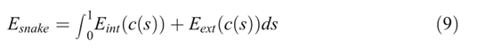
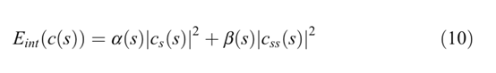
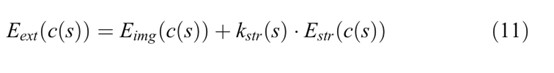
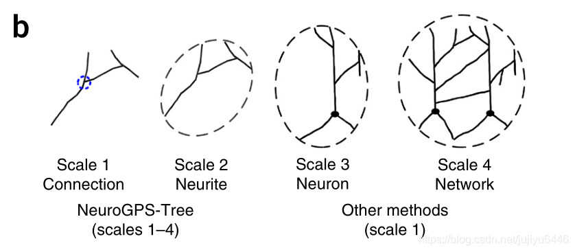
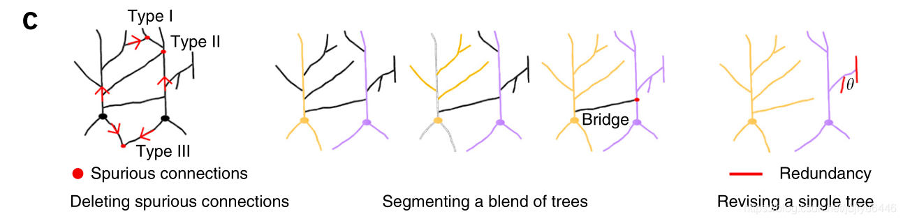

有关神经元重构算法的总结  
参考网址：  
https://blog.csdn.net/qq_39567625  
https://blog.csdn.net/jujiyu6446  
## 目录
* [Snack算法 2011](#Snack算法)
* [APP算法 2011](#APP算法)
* [MOST算法 2013](#MOST算法)
* [APP2算法 2013](#APP2算法)
* [SmartTrace算法 2015](#SmartTrace算法)
* [TReMAP算法 2016](#TReMAP算法)
* [NeuroGPS-Tree算法 2016](#NeuroGPS-Tree算法)
* [ENT算法 2017](#ENT算法)
* [DL Segmentation Improves Reconstruction 2017](#DL_Segmentation_Improves_Reconstruction)
* [半自动追踪算法 2017](#半自动追踪算法)
* [Deeptracing算法 2018](#Deeptracing算法)
* [Rivulet2算法 2018](#Rivulet2算法)

## Snack算法
Wang Y, Narayanaswamy A, Tsai C L, et al. A broadly applicable 3-D neuron tracing method based on open-curve snake[J]. Neuroinformatics, 2011, 9(2): 193-217.
### 预处理
1. 预处理的第一步  去噪、增强连续性  curvelet and scalar voting algorithm
2. 预处理的第二步GVF 计算向量场（这是snack模型中的deforming force）和雅可比矩阵。
3. 预处理的第三步  Frangi’s  vesselness measure ,这个是利用雅可比矩阵管状结构。特征值.这个不会增强分支点
4. pre-segmentation 预分割graph-cut segmentation ，vessel-cut。每一个z slice 单独。
5. 预处理最后一步，种子点获取。有几种方式：
- 方式1，极值点，极值点沿GVF移动几次。
- 方式2，骨架化。去除半径以内的重复点。
- 方式3，local maximal vesselness。
7. 所有种子点根据对应的vesselness values排序。
### 模型
模型是个最小化的模型，包含两个值。内力和外力。内力控制延伸与否，外力使得其靠近中心线。  
  
  
  
### 特点
双向追踪
### 后处理方法
1. 长度阈值
2. 去除没有连接到主树的树
### Tips
1. If accepted, seed points within a certain user-set distance to this snake are removed from the seed list to avoid repeat tracing.一条snack如果被接收了，那么其一定宽度范围内的其他种子点都会被移除，防止重复追踪。
2. Next, in order to avoid fragmented traces caused by gaps or holes in the foreground, we plan to employ graph-based approaches like minimum spanning tree or perceptual grouping approaches for automatic fragmentation linking.避免因gap或holes提前停止的话，可能需要采用基于图论的方法或者感知生长的方式。
3. Leakage (snake growing into the background)到达边界时disabling the stretching force。k(s)=0

## APP算法
Peng H, Long F, Myers G. Automatic 3D neuron tracing using all-path pruning[J]. Bioinformatics, 2011, 27(13): i239-i247.
### 介绍
All-path pruning（APP）是一种基于图结构的3D神经元自动重建算法。该方法对由成像技术造成的低信噪比、模糊残缺的图像具有较强的鲁棒性。  
### APP算法流程
APP算法分为两个步骤：  
1. 采用最短路径算法生成ICR（initial over-complete reconstruction ）  
  选取soma或者图中强度最高的点作为seed种子点。并且选取整张图片的平均强度ta，将像素大于ta的部分归为前景部分（选取较小的阈值目的是尽可能追踪每一个前景部分）。前景部分生成一个无向图G，采用Dijkstra algorithm计算seed种子点到每个前景的最短路径，得到tree graph（ICR）。  
2. 对重建结果进行修剪：MCMR subgraph algorithm  
  修剪算法maximal-covering minimal redundant(MCMR) subgraph algorithm分为三个部分：暗叶节点修剪Dark-leaf pruning (DLP)、覆盖叶节点修剪Covered-leaf pruning (CLP)、中间节点修剪Inter-node pruning (INP)  
  - Dark-leaf pruning (DLP)：选取视觉最低可见强度（8比特的图像中一般为30）为阈值tv，删除ICR中所有强度低于tv的nodes。该步骤剔除在追踪过程中被归为前景的较暗“背景点”。  
  - Covered-leaf pruning (CLP)：该部分是为了修剪叶节点。从叶节点开始循环迭代计算相邻节点间的sphere覆盖率，当覆盖率大于给定阈值时，删除该节点。  
  - Inter-node pruning (INP) ：优化seed、branching nodes、leaf nodes间的连接关系， 使神经元枝干更“平滑”、“简洁”。 类似CLP的工作，从叶节点开始循环计算相邻节点间的sphere覆盖率，删除被过多覆盖的部分。
### 总结
APP是一种快速的神经元自动重建算法，对于局部最小值不敏感、不依赖于先验的模型，具有较好的跨越gap的能力（在追踪过程中先尽可能考虑覆盖所有点，然后再修剪）。在生成无向图G的过程，边距e不仅考虑了欧式距离，还限制了条件（the edge weight between bright voxels will have smaller value than that between dark voxels.），对于最终的结果还可进一步采用 the gradient descent based deformable curve optimization 对修剪结果进行优化。

## MOST算法
Ming X, Li A, Wu J, et al. Rapid reconstruction of 3D neuronal morphology from light microscopy images with augmented rayburst sampling[J]. PloS one, 2013, 8(12): e84557.
### 主要内容
1. 单阈值二值化，每一个连通域内生成一个种子点。
2. 步进式追踪。采用局部的前景信息。
3. 每走一步，将周围半径以内球形标记为已追踪。
4. 提取前进方向的半球形以内，半径<d<半径+2 内前景。聚类，聚类的中心点作为下一个点的位置。为什么是半球形是因为要屏蔽往回的方向。
5. 获取下一步方向。每一步的步长约等于半径。
### 算法缺点
* 不能跨越gap
* 看似形状符合，但是实际上可能每一个连通域内有一个-1点。也就是说不是连在一起的。
### 算法特点
* 采用局部的信息，不用生成其他的信息，运算速度很快。
* 步进式的追踪，每走一步判断一步。

## APP2算法
Xiao H, Peng H. APP2: automatic tracing of 3D neuron morphology based on hierarchical pruning of a gray-weighted image distance-tree[J]. Bioinformatics, 2013, 29(11): 1448-1454.
### 介绍
All-path pruning 2.0（APP2）是一种基于图结构的3D神经元快速自动重建算法。是目前速度最快的算法，能可靠地生成神经元重构的树状结构。  
APP2具有以下特点：第一，对灰度图像进行距离变换，而无需二值化处理；第二，追踪过程基于Fast Marching算法，计算代价小；第三，剪枝过程采用“长段优先分层“处理方式。  
### 算法流程
APP2算法包括三个步骤：距离变换GWDT(gray-weighted distance transform)、采用FM算法进行追踪、分层剪枝。  
1. 距离变换GWDT  
距离变换的目的在于增强靠近中心线上的图像强度，减小靠近边缘的图像强度。某点的GWDT的距离值定义为该点到背景的最短路径上的像素强度之和。（the distance value for each pixel is defined as the sum of image pixels’ intensity along the shortest path to background）  
首先选取一个较小的阈值区分前景、背景。选取所有背景点为seeds并标记为ALIVE，前景标记为FAR。遍历每一个边缘点（与FAR相邻的seeds），计算该点到领域的最小距离值，并将该领域点标为TRIAL，同时更新边缘的距离值。接着从这些被标为TRIAL的点开始计算其领域内的距离最小值点，并标记为TRIAL,并将前一个点标记为ALIVE,循环迭代该过程。选取距离变化后最大值的点为soma（或称root）  
2. 采用FM算法进行追踪  
追踪采用FM算法，并且在追踪过程中通过标记每个节点的parent节点从而构建神经元结构连接关系。然后从root点开始采用FM算法（类似距离变换的过程）进行最终，并根据连接关系生成重建结果。  
3. ”长段优先分层“剪枝  
- Hierarchical segments construction  
定义两个分叉点（branching nodes）间的部分为segment，将重建结果的segments按长度排序。具体实现过程可从每个叶节点开始，找到其最近的分叉点（每个分叉点连接至少两个segments），将短segment标记为长segement的child-segment，迭代这个过程。  
- Recursive pruning  
将APP的node-coverage-ratio推广为segment-coverage-ratio，计算两个segements的覆盖率，若大于阈值（一般取75%）则删除被覆盖的segement及其所有child-segments，迭代该过程。  
### 总结
APP2算法由于采用Fast Marching算法，计算代价小，处理速度快；在神经元追踪前对图像进行GWDT变换，使其符合神经元图像强度从中心线向外递减的一般规律，增强重建结果的鲁棒性。“长段优先分层”剪枝使得APP2算法相比APP1的后处理能力有较大提升。

## SmartTrace算法
Chen H, Xiao H, Liu T, et al. SmartTracing: self-learning-based neuron reconstruction[J]. Brain informatics, 2015, 2(3): 135-144.
### 创新点：
1. 提出了追踪区域的可信度指标，可信度高的区域作为训练样本。
2. 基于小波变换和最大相关性-最小冗余度方法，进行特征选取。
3. 采用机器学习方法，可信度高的区域作为样本进行训练，生成的分类器对前景进行预测（可迭代预测，跨越gap）。
4. 预测的结果再次采用传统算法追踪，提高准确度
### 优点
1. 全自动
2. 不依赖于先验知识
### 缺点
1. 依赖现有算法的效果（如APP2、MOST）
2. 耗时

## TReMAP算法
Zhou Z, Liu X, Long B, et al. TReMAP: automatic 3D neuron reconstruction based on tracing, reverse mapping and assembling of 2D projections[J]. Neuroinformatics, 2016, 14(1): 41-50.
### 主要特点
* Virtual Finger
* 超级大图像 10GB级别
* 速度快 内存消耗少
### 主要流程
1. MIP 转化成二维图片，然后APP生成对应的追踪结果
2. 将追踪结果从分支点处分割成不同的段，segment
3. 每一个segment  有一个bounding box ，提取对应的3D区域。这是降低内存需求的主要方法。
4. CDA2  Virtual Finger。 Curve-Drawing Algorithm 2 
5. MST minimal spanning tree 最小生成树
6. XY平面做基准，其他平面XZ  YZ补充。
### BlastNeuron ranking scores
* BlastNeuron : Basic Local Alignment Search Tool for Neurons
* BlastNeuron was designed to accurately and efficiently retrieve morphologically and functionally similar neuron structures based on global appearance, detailed arborization patterns, and topological similarity.

## NeuroGPS-Tree算法
1. Quan T, Zheng T, Yang Z, et al. NeuroGPS: automated localization of neurons for brain circuits using L1 minimization model[J]. Scientific reports, 2013, 3(1): 1-7.  
2. Quan T, Zhou H, Li J, et al. NeuroGPS-Tree: automatic reconstruction of large-scale neuronal populations with dense neurites[J]. Nature methods, 2016, 13(1): 51-54.
华中科技大学校报上说，该研究借鉴人脑执行知觉功能时的先整体后局部的识别策略，递进式地利用多尺度信息，快速从神经元的三维荧光图像中重建出神经元群落。
## 主要内容
这篇文章，对于单个神经元细胞追踪用的篇幅比较少。这部分主要的内容在之前的工作。（即为引用中13年的那篇）  
文章说他们除了局部像素强度信息，还用到了结构信息和统计信息，但是没有详细的描述，这部分的内容应该是在代码里面体现了。  
  
NeuroGPS-Tree uses signal information at different scales to identify spurious links.  
这篇文章主要的内容讲的是多个神经元经过重建之后，可能会产生错误的连接。  
  
1. 首先，去除掉的是不符合结构特征的信息。文章中说能够去除3种信息。
2. 找沟通两个SOMA的桥，并切断这种连接。
- 如果某一条轴突直接连接SOMA，那这条轴突一定是归属于该SOMA。
- 上一步被指定轴突被排除，与其他SOMA没有连接的，也被排除。
- 没有被排除的突触被认为是桥。在对比桥的端点信号强度对比后，未指定的突触之间的桥和桥的一个端点被删除
3. 最后，标记神经元树的冗余部分。
  
The procedure for identifying spurious links. In the left-hand panel, spurious links (red dots) are defined and deleted after confirmation of the neurites’ directions (red arrows). The center panel illustrates the segmentation of the blended trees. First, neurites that connect directly to the soma are assigned to their own soma. Second, the assigned neurites (gray) are deleted, and the neurites that have no links to any other soma (purple) are assigned to the soma directly connected to the deleted neurites. Third, a bridge from the unassigned neurite is identified (black), and one end of the bridge (red dot) is deleted on the basis of comparison of the signal strengths of the two ends of the bridge. In the right-hand panel, a neuronal tree is revised after the redundant neurites (red) have been identified.  

## ENT算法
Wang C W, Lee Y C, Pradana H, et al. Ensemble neuron tracer for 3D neuron reconstruction[J]. Neuroinformatics, 2017, 15(2): 185-198.  
### 介绍
ENT(Ensemble neuron tracer for 3D neuron reconstruction)受机器学习算法中 集成学习（ensemble learning）的启发，将多个追踪结果进行融合，得到较好的结果。  
### 算法流程
1. 对一幅输入图像 d 进行第一次数据扰动（Data Perturbation，DP1）生成多个结果。扰动方法包括Nmodel、SModel、BModel。
2. 使用Smart Data Selection(SDS)除去异常。包含大量fase positive signals的结果被认为是异常。
3. 进行第二次数据扰动（DP2），扰动结果为进行过膨胀、闭操作（先膨胀后腐蚀，均为形态学处理方法）的图像以及原始图像。
4. 对各模块进行追踪Base Tracer（APP2或MOST）；
5. 利用Combiner对相同扰动下的追踪结果进行融合；  
T2与T1融合是通过判断T2中的节点相较于T1中的节点的距离，大于一定的阈值则新增该节点，否则，用T2替换T1。
6. Model Selection对融合结果进行选择，得到最终输出结果。  
判断输入的图片是否纯净（判断density value），如果是则选择含有最多节点数的模型；如果不纯净，则先除去节点数大于阈值的模型（因为可能包含很多false positives），然后选择剩下模型中节点数最多的作为最终结果。
### 总结
ENT（APP2）消耗时间不超过APP2的三倍，错误率有较明显的减少，特别是对于噪声信号。文章中提到，APP2由于the sequential searching behavior，遇到较弱的信号无法追踪，而MOST，it detects fragments of highly expressed paths to achieve lower ESAs。

## DL_Segmentation_Improves_Reconstruction
Li R, Zeng T, Peng H, et al. Deep learning segmentation of optical microscopy images improves 3-D neuron reconstruction[J]. IEEE transactions on medical imaging, 2017, 36(7): 1533-1541.  
### 概述
本文的主要思想是——分割（Deep learning）+重建（传统追踪算法）。3D-FCN(fully concolutional network，全卷积网络)进行逐像素分割，网络采用了inception模块和residual learning模块解决网络层数加深带来的问题，并加入deconvolutioal layer实现端对端操作（输入输出图像大小一致）；
### 算法步骤
1. 将图像输入NN architecture，得到对应的probability map P，P中每个一个元素表示该元素对应原图像中像素点为前景部分的概率。
2. 为抑制噪声，对图像进行修正：
- 将P(x)中每一个元素与255相乘（小数就近取整）得到~P
- 对于输入图像I(x)计算~I，若P(x)≤δ，则为0，若P(x)＞δ，则为I(x)
- 计算修正后的图像F(x):F(x)=α~I(x)+(1-α)~P(x)
3. 利用传统追踪算法APP，APP2,SmartTracing等方法对F(x)进行重建。
### 文章提出的几个问题
- CNN用于神经元图像分割的困难主要有：一是需要不同尺度的filters提取特征（主干细长，分支和bifurcation需要在小尺度上提取
局部信息）；二不同种类的样本之间差异过大；三是数据集中的图像质量相差较大（例如图像强度）。
- inception模块使用不同尺度的卷积核进行特征提取；
- 在loss层对前景和背景使用不同的权重，以解决前景和背景部分的像素数量不平衡问题。
- 本文使用的评价指标：entire structure average、different structure、percentage of different structures。

## 半自动追踪算法
Zandt B J, Losnegård A, Hodneland E, et al. Semi-automatic 3d morphological reconstruction of neurons with densely branching morphology: Application to retinal aii amacrine cells imaged with multi-photon excitation microscopy[J]. Journal of neuroscience methods, 2017, 279: 101-118.  
### 主要流程
1. 反卷积去噪
2. 手动圈出平面内neuron存在的区域，其他区域置0.
3. 初始分割自适应阈值。自适应阈值=5%最大图像强度+自适应值，分割轴突
4. 全局固定阈值分割，分割SOMA和树突。11%最大图像强度，去除所有20体素以下部分。
5. Fast marching 骨骼化 最小生成树
6. 手动确定SOMA轮廓，去除SOMA区域内所有的小分支。骨骼化在SOMA上会带来错误
### 特点
除了DIADEM metric 还用到了 Dice coefficient这么一个量纲

## Deeptracing算法
Zhou Z, Kuo H C, Peng H, et al. DeepNeuron: an open deep learning toolbox for neuron tracing[J]. Brain informatics, 2018, 5(2): 1-9.  
### 介绍
论文介绍了DeepNeuron的toolbox，分为五个部分。  
1. Neurite signal detection：检测前景部分  
采用CNN网络区分前景和背景，无需预处理。为了加快速度和降低GPU内存占用，使用2D的CNN模型（5个卷积层加上的AlexNet）。先将3D图像栈做2D的MIP投影，检测2D图像的前景部分，并用mean shift算法优化提取结果，接着将2D的结果投影回3D上，最后再用一次CNN网络对结果进行修正。  
2. Neurite connection 连接前景部分  
采用修正的Siamese networks（孪生网络），通过从人类注释的大型数据集（空间上标注为连续的两个点作为positive sample，空间位置上标注为分离的点作为negative sample）学习神经突的连通性。本方法可以成功地连接具有较大间隙的神经突片段。  
思路是通过计算两个点特征向量间的欧氏距离，来将最近的两个点连接起来。  
3. smart pruning 剪枝  
用不同方法生成多个（过度追踪的）重建结果，接着用CNN的网络过滤掉每个重建结果中被错误追踪的点。然后，将所有过滤后的重建结果融合在一起形成最终结果。  
4. Manual reconstruction evaluation
该模块用于评估不同标注者之间或同一标注者在不同时间进行手动重建的一致性。将手工重建结果与原图输入到网络中，形成初始预测结果；根据方向，尖端位置和距离，自动连接初始预测中的片段以生成精确的预测；评价手工重建与精确预测结果的一致性，用consistency score表示。  
5. Classification of dendrites and axons
在手工标注时，能够对树突和轴突、背景部分进行实时分类。采用的网络与Neurite signal detection类似。  

## Rivulet2算法
1. Liu S, Zhang D, Song Y, et al. Automated 3-D neuron tracing with precise branch erasing and confidence controlled back tracking[J]. IEEE transactions on medical imaging, 2018, 37(11): 2441-2452.
2. Liu S, Zhang D, Liu S, et al. Rivulet: 3d neuron morphology tracing with iterative back-tracking[J]. Neuroinformatics, 2016, 14(4): 387-401.  
3. Zhang D, Liu S, Liu S, et al. Reconstruction of 3D neuron morphology using Rivulet back-tracking[C]//2016 IEEE 13th International Symposium on Biomedical Imaging (ISBI). IEEE, 2016: 598-601.
### 主要内容
Rivulet2的源代码在vaa3d上能够找到，结合Rivulet2的源代码和结果谈谈效果和一些需要改进的点。  
在追踪之前，先将图像根据输入的参数二值化，将完全没有前景像素的地方砍掉，存储到另一个地方。  
R2将神经元的追踪分为了6个步骤。  
前五个步骤分在预处理中，最后一个步骤是迭代。  
前五个步骤分别是：  
- 距离变换
- 通过距离变换找SOMA和SOMA 半径，并设置SOMA MASK。
- 得到速度图。
- MSFM
- 获取gradient map，梯度图。
  
第六个步骤是迭代。  
* 预备步骤
  1. Erase SOMA MASK
  2. 膨胀二值图。
* 迭代步骤 当遍历点少于98%时
  1. 获取距离图最远点
  2. Erase 最远点为-2
* 步进步骤 ，不停循环
  1. step。根据梯度图步进一步。
  2. 判断是否离开边界
  3. 判断gap是否大于8倍平均半径
  4. 判断是否到达SOMA
  5. 判断是否原地踏步15次
  6. 判断confidence系数是否较低
  7. 判断是否到达之前已经被追踪过的点。
* 判断是否保留以及erase
### 算法特点
1. 从MSFM的最远点，将该点作为追踪迭代的起点。这种点大概率优先满足末梢点的要求。
2. 通过预处理中得到的梯度图，利用RK4算法，龙格库塔算法，往某一个方向步进。
3. 判断该步进是否触及边界、是否触及已被追踪的点，是否触及SOMA，是否是低可信度等。满足不同的条件，进行不同的处理。
### 算法缺点
1. 存在一些不该产生的毛刺。这个问题APP2也存在。这个问题不是单纯的剪枝能够解决的。每一个点被追踪一次。这是ALL-PATH-Pruning 所必须面对的问题。
2. 距离图的最远点不等于是末梢点，这个问题产生的原因是因为在经过gap的时候，会将这些点的距离值增大。举例来说，就是某一个分支第一次追踪起点可能是中间某一个点。这导致最后追踪的结果可以看到中间是分段的。
3. 半径估计不准。这个问题的起源可能在于追踪起点不是在中心，而是在边缘。
