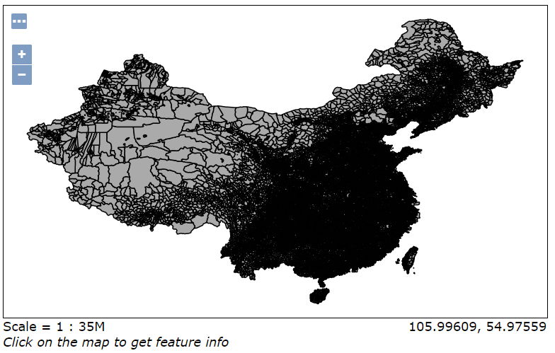

## Geoserver
### Geoserver简介
### Geoserver安装
这里简要说明linux上的geoserver的安装
参考流程：https://www.cnblogs.com/yangzhengier/archive/2020/03/31/12606606.html

在不使用外网的情况下（不使用yum）
Java配置方式：https://www.jianshu.com/p/c944e49a09d5
Tomcat配置方式：https://www.jianshu.com/p/dfddbd8da05d

目前已经在服务器上搭建Geoserver，可以访问http://172.18.247.61:8080/geoserver/web/ 进行查看（但是数据上传只能上传本机数据）
默认用户名：admin，默认密码：geoserver

### Geoserver实例
**本部分流程参考链接：**https://blog.csdn.net/cj9551/article/details/110821916

#### 地图服务发布
GeoServer 支持发布多种数据格式，常见的格式有GeoTIFF、Shapfile、ImageM 等。本文以 Shapfile 为例进行介绍。提供的数据格式如下：

##### 其他数据
如果使用数据不在本身支持范围内，例如MBTilers数据，可以在Geoserver插件中下载安装
参考教程：https://blog.csdn.net/dyxcome/article/details/98375453

#### 数据准备
这里使用全国乡镇级行政区划数据
链接：https://pan.baidu.com/s/1DZ3SD1-XdIiywXvUOtc89Q
提取码：pjt8
参考教程链接：https://blog.csdn.net/cj9551/article/details/110821916

#### 图层发布
步骤包括三个部分
1. 创建工作区
2. 创建数据储存以及发布图层
3. 预览发布图层

##### 创建工作区
首先需要创建新的工作区，单击左侧 工作区 按钮，进入工作区面板。然后点击添加新的工作区；输入工作区的名字和命名空间 uri；注意这里的工作区名称是唯一的，命名空间 uri 就是可以通过 uri 可以随便填；然后点击提交。

##### 创建数据储存
然后我们需要创建数据存储，来添加数据源；点击数据存储，然后点击添加新的数据存储，进入新建数据源面板；

在新建数据源面板中，单击“ Shapefile - ESRI™ Shapefiles ( * .shp)”选项；

然后填写基本的存储信息：
工作区选择我们新建的工作区，然后写上数据源名称；方便下次发布找到该数据源；以及在连接参数中找到我们需要发布的数据。

点击保存之后跳转到新建图层页面，然后选择刚刚的数据进行发布图层，然后点击发布，会按钮进入编辑图层界面：

在图层编辑界面中，可以修改图层名以及标题等：

然后需要获取到边框以及纬度/经度边框，可以直接点击从数据中计算即可：

##### 预览图层
点击左侧的 Layer Preview，然后搜索我们刚刚发布的图层，然后点击 openlayers ，就可以在 geoserver 内置的 openlayers 模式进行打开图层，进行预览；

**有关发布数据和叠加图层，可以具体看链接中后续的展示**
（图层叠加主要是通过构建图层组）