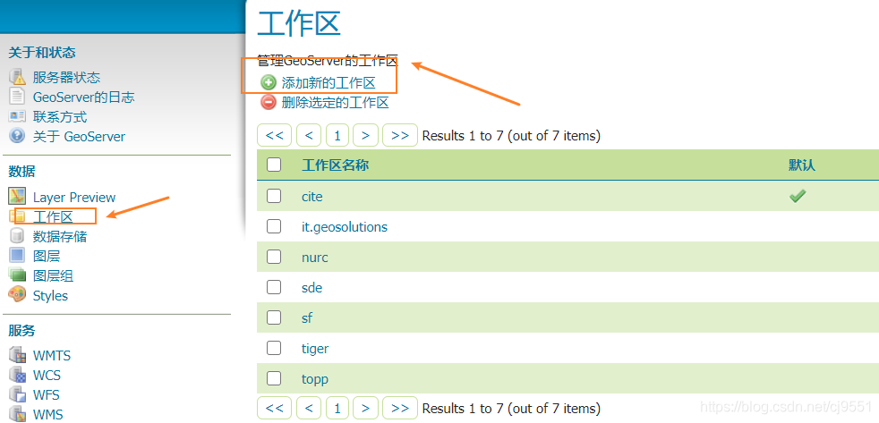

# Geoserver
## Geoserver简介
有关GIS基础知识介绍：[webGIS开发背景知识索引--瓦片原理与数据规范等](https://zhuanlan.zhihu.com/p/144767787)  
参考文献：[基于开源技术的WebGIS系统构建与应用](https://kns.cnki.net/KCMS/detail/detail.aspx?dbcode=CMFD&dbname=CMFD201402&filename=1014325247.nh&uid=WEEvREcwSlJHSldRa1FhdkJkVG1BK3kwWFBjV3psME1ZQTliWjhSWWMrOD0=$9A4hF_YAuvQ5obgVAqNKPCYcEjKensW4IQMovwHtwkF4VYPoHbKxJw!!&v=MDkzMjBlWDFMdXhZUzdEaDFUM3FUcldNMUZyQ1VSTE9mWWVkbUZ5RG1WYnJMVkYyNkdyQzZHOVBJcUpFYlBJUjg=)  
原码介绍：[关于GeoServer我们还能做什么？](https://zhuanlan.zhihu.com/p/87894011)

感兴趣可以阅读全文，这里摘选一些重要的部分：  
#### geotool
geotool是OGC（开放地理空间联盟）提供的一套用于GIS（地理信息系统）数据处理与服务的JAVA开源库，GDAL是它的python版  

geotool功能强大，涵盖了GIS领域所有底层算法和服务框架，它能进行空间运算、图像处理、地图发布等。最常用的geotool套件是jts，jts主要运用DE-9IM模型，进行矢量数据的空间运算  

 

#### geoserver
因为geotool发布WMS服务难度高（地图渲染、瓦片裁切等都要从最底层开始写，还会遇到JVM、JAI性能问题），故geoserver应运而生  

geoserver底层用的也是java+geotool，它构建了一个jetty的web工程。有了geoserver，我们不用写代码，启动一个页面工具，就能发布地图了  

geoserver官网：http://geoserver.org/  

 

#### openlayer
openlayer是一个专为webGIS开发提供的JavaScript库包，用以实现标准格式发布的地图数据访问。openlayer是完全依照WMS标准来的，与geoserver有很好的兼容性  

除了openlayer外，各图商也提供基于自身地图的前端脚本，如果仅仅是简单的地图展示与操作，可以使用谷歌、高德、腾讯、百度等地图的JavaScript API  

除了openlayer外，还有比较火的开源JavaScript库包，就是leaflet了，相对来说，leaflet更轻量，使用群体更广，且官方网站提供全部的交互源码的下载，它的开发文档更易读，对非专业人士更友好，上手更快  

但leaflet并没有完全依照WMS规范，不支持单瓦片加载（多瓦片，面注记会冗余），坐标系转换等功能，且绘制功能较弱  

不过实话实说，openlayer比leaflet复杂，且使用人群没有leaflet多，参考资料较少，故如果对GIS和OGC规范，包括坐标系定义、投影定义、GML（带地理空间信息的XML语言）数据格式定义、地图瓦片原理、图层概念、制图风格等，不太了解的话，建议使用leaflet，因为openlayer的交互都是基于wms服务来的  

且leaflet维护的人多，各种插件也很多，做热力图和轨迹图等展示用的demo更多更炫  

openlayer官方网站：https://openlayers.org  

leaflet官方网站：https://leafletjs.com  

 

#### postgresql
常用的开源数据库非常多，但对于webGIS来说，postgresql应该是最好的选择  

首先，geoserver与postgresql兼容，其次postgresql有很多很有用的插件，例如空间计算插件postgis、基于postgis的拓扑套件postgis_topology、路径规划插件pgrouting、文本模糊匹配fuzzystrmatch、tiger英文地址编码postgis_tiger_geocoder、地址标准化插件address_standardizer、时空检索插件pg-trajectory等  

依托于这么丰富的扩展性，除了webGIS，postgresql还可以应用在时空数据处理、路径规划、地理编码上，有可能数据库插件自带的成熟算法，要比自己写的好很多  

postgresql官方网站：https://www.postgresql.org/  

postgis官方网站：http://www.postgis.org/  

#### 总结
我们需要知道有OGC，OGC的WMS规范，地图发布都是依据这个规范来的，遵循地图瓦片的原理。不过各图商在发布的时候，瓦片尺寸、起始坐标、地图风格，会有细微不同  

为什么要发布瓦片地图？就是因为内容多、数据量大，不发布成栅格瓦片，根本没有办法传到前端并渲染  

因为要发布地图，所以我们需要了解geotool和geoserver、发布完成后，要有展示，所以需要知道openlayer前端脚本库，数据是要交互的，所以要了解WKT和WKB、geojson  

数据存在哪里？postgresql  

**系统结构图：**

 

## Geoserver安装
windows上可以直接下载geoserver的exe文件，或者编译好的程序包  

这里简要说明linux上的geoserver的安装  
参考流程：https://www.cnblogs.com/yangzhengier/archive/2020/03/31/12606606.html  

在不使用外网的情况下（不使用yum）  
Java配置方式：https://www.jianshu.com/p/c944e49a09d5  
Tomcat配置方式：https://www.jianshu.com/p/dfddbd8da05d  
目前已经在服务器上搭建Geoserver，可以访问http://172.18.247.61:8080/geoserver/web/ 进行查看（但是数据上传只能上传本机数据）  
默认用户名：admin，默认密码：geoserver  
 

## Geoserver手动实例
**本部分流程参考链接：**https://blog.csdn.net/cj9551/article/details/110821916  
 
#### 地图服务发布
GeoServer 支持发布多种数据格式，常见的格式有GeoTIFF、Shapfile、ImageM 等。本文以 Shapfile 为例进行介绍。提供的数据格式如下：  

 
##### 其他数据
如果使用数据不在本身支持范围内，例如MBTilers数据，可以在Geoserver插件中下载安装  
参考教程：https://blog.csdn.net/dyxcome/article/details/98375453  
 
#### 数据准备
这里使用全国乡镇级行政区划数据  
链接：https://pan.baidu.com/s/1DZ3SD1-XdIiywXvUOtc89Q  
提取码：pjt8  
参考教程链接：https://blog.csdn.net/cj9551/article/details/110821916  
 
#### 图层发布
步骤包括三个部分  
1. 创建工作区
2. 创建数据储存以及发布图层
3. 预览发布图层
 
##### 创建工作区
首先需要创建新的工作区，单击左侧 工作区 按钮，进入工作区面板。然后点击添加新的工作区；输入工作区的名字和命名空间 uri；注意这里的工作区名称是唯一的，命名空间 uri 就是可以通过 uri 可以随便填；然后点击提交。  

 
##### 创建数据储存
然后我们需要创建数据存储，来添加数据源；点击数据存储，然后点击添加新的数据存储，进入新建数据源面板；  

在新建数据源面板中，单击“ Shapefile - ESRI™ Shapefiles ( * .shp)”选项；  

然后填写基本的存储信息：  
工作区选择我们新建的工作区，然后写上数据源名称；方便下次发布找到该数据源；以及在连接参数中找到我们需要发布的数据。  

点击保存之后跳转到新建图层页面，然后选择刚刚的数据进行发布图层，然后点击发布，会按钮进入编辑图层界面：  

在图层编辑界面中，可以修改图层名以及标题等：  

然后需要获取到边框以及纬度/经度边框，可以直接点击从数据中计算即可：  

 
##### 预览图层
点击左侧的 Layer Preview，然后搜索我们刚刚发布的图层，然后点击 openlayers ，就可以在 geoserver 内置的 openlayers 模式进行打开图层，进行预览；  

**有关发布数据和叠加图层，可以具体看链接中后续的展示**  
（图层叠加主要是通过构建图层组）  

## 代码参考
#### Openlayers调用Geoserver
[参考链接](https://blog.csdn.net/c17854254215)
包括：
[发布地图服务](https://blog.csdn.net/c17854254215/article/details/106467046)
[地图点击显示弹窗](https://blog.csdn.net/c17854254215/article/details/106468357)
[地图上进行点标记](https://blog.csdn.net/c17854254215/article/details/106473228)
[地图上绘画多边形和矩形](https://blog.csdn.net/c17854254215/article/details/106488801)

#### 实际样例
##### 原始数据下载
开源数据一般使用Landsat数据集  
一般从earth explorer或者地理空间云平台下载  
[在地理空间云平台下载数据教程](https://www.cnblogs.com/xingyi-qjl/p/9255961.html)  
